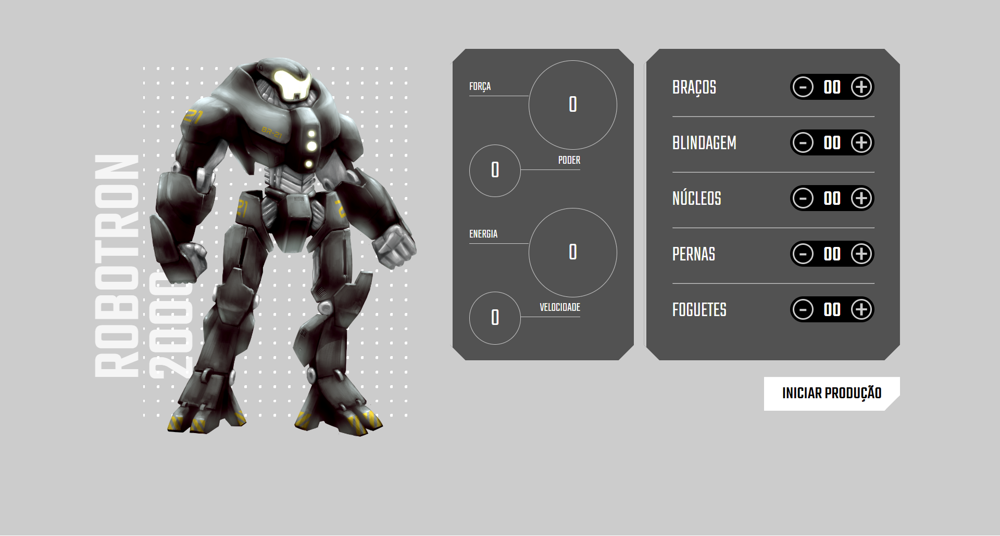

# robotron-2000
Projeto criado durante o curso JavaScript: manipulando o DOM, da Alura.

Melhorias: 
- Refatoração do codigo; 
- Limitaçao dos equipamentos recebendo apenas quantidades positivas e não excedendo duas casas decimais;

Você pode ver o resultado final [aqui](https://jessicalorenzon.github.io/robotron-2000).

